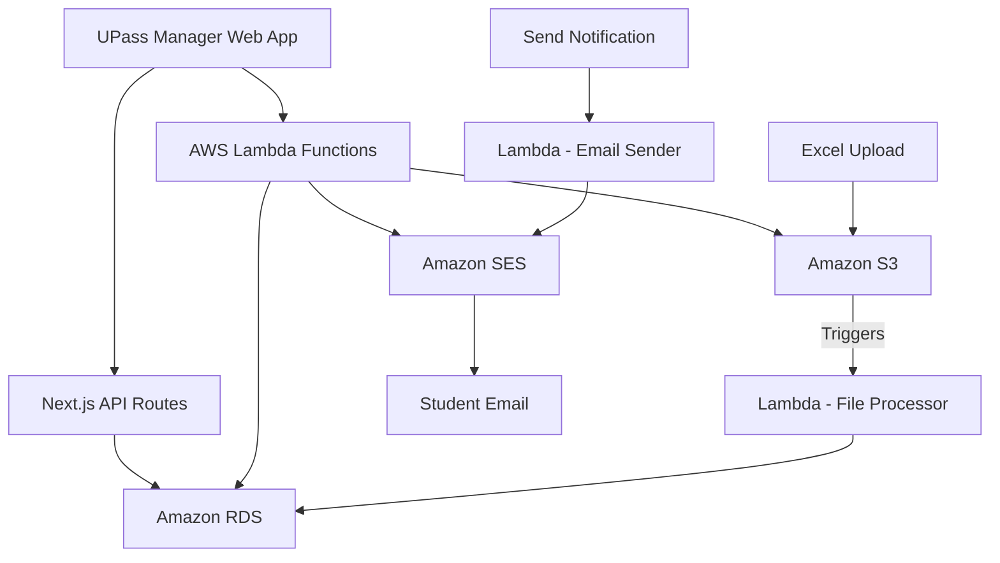

# AWS Integration Documentation

This document provides details about the AWS services used in the UPass Manager application and how they're integrated with the application.

## Overview of AWS Services

The UPass Manager application leverages the following AWS services:

1. **AWS Lambda** - For serverless computing to process data and send notifications
2. **Amazon RDS** - For relational database storage of UPass records
3. **Amazon S3** - For storage of uploaded Excel files containing UPass data
4. **Amazon SES** - For sending email notifications to students

## Architecture Diagram



## Lambda Functions

### 1. S3 File Processor Lambda

**File Path:** `src/cloud/lambda-code/lambda_handler.mjs`

**Purpose:** This Lambda function is triggered whenever a file is uploaded to the S3 bucket in the `raw_data/` folder. It reads Excel files containing UPass records, processes the data, and inserts/updates records in the RDS database.

**Trigger:** S3 bucket event (object creation)

**Environment Variables:**
- `RDS_HOST` - Host address of the RDS instance
- `RDS_USER` - Username for RDS authentication
- `RDS_PASSWORD` - Password for RDS authentication
- `RDS_DB` - Database name

**Input:** S3 event notification containing bucket name and object key

**Process Flow:**
1. Validates the S3 event and extracts the bucket and file key
2. Checks if the file is in the `raw_data/` folder
3. Determines which database table to update based on the filename
4. Retrieves the file from S3
5. Parses the Excel file using the XLSX library
6. Connects to the RDS database
7. Processes each row in the Excel file:
   - Formats dates appropriately
   - Converts "Yes"/"No" strings to boolean values
   - Inserts or updates records in the appropriate table
8. Returns a success or error response

**Output Example:**
```json
{
  "statusCode": 200,
  "body": "Database table u_pass_manager_fall_2024 updated successfully"
}
```

### 2. Email Notification Lambda

**File Path:** `src/cloud/lambda-code 2/index.js`

**Purpose:** This Lambda function sends email notifications to students using Amazon SES. It's triggered when someone clicks the "Send Notification" button in the UPass Manager application.

**Trigger:** API Gateway HTTP request or direct invocation from application code

**Environment Variables:**
- `SOURCE_EMAIL` - Verified sender email address for SES (currently set to 'gettingaround@vt.edu')

**Input Example:**
```json
{
  "recipients": ["student1@vt.edu", "student2@vt.edu"],
  "subject": "U-Pass Notification",
  "message": "Your U-Pass is ready for pickup at the Student Services Building."
}
```

**Process Flow:**
1. Validates the input payload to ensure recipients and message content are provided
2. Sends an email to each recipient using Amazon SES
3. Tracks successful and failed email deliveries
4. Returns a response with details about the email sending results

**Output Example:**
```json
{
  "statusCode": 200,
  "body": {
    "success": true,
    "message": "✅ Sent 2 email(s). Failed to send 0 email(s).",
    "results": {
      "successful": ["student1@vt.edu", "student2@vt.edu"],
      "failed": []
    }
  }
}
```

## Amazon RDS

**Purpose:** Stores all UPass Manager data including student records, card data, and distribution information.

**Tables:**
- `u_pass_manager_current`: Current semester UPass data
- `u_pass_manager_fall_2024`: Fall 2024 semester UPass data
- `u_pass_manager_spring_2024`: Spring 2024 semester UPass data

**Schema:** Each table contains the following fields:
- `U_Pass_ID`: Primary key for UPass record
- `Active_U_Pass_Card`: Currently active UPass card number
- `Replaced_U_Pass_Card`: Previously used UPass card number (if replaced)
- `Metro_Acct`: Metro account number
- `Distribution_Date`: Date the UPass was distributed
- `Picked_Up_By`: Person who picked up the UPass
- `Student_ID`: Student ID number
- `First_Name`: Student's first name
- `Last_Name`: Student's last name
- `Email`: Student's email address
- `Disclaimer_Signed`: Boolean indicating if the disclaimer was signed
- `Notes`: Additional notes about the UPass

## Amazon S3

**Purpose:** Stores uploaded Excel files containing UPass data.

**Bucket Structure:**
- `raw_data/`: Contains uploaded Excel files that trigger the Lambda function
  - Files with naming pattern `Mockup_Data_UPass_Fall_2024` are processed for the Fall 2024 table
  - Files with naming pattern `Mockup_Data_UPass_Spring_2024` are processed for the Spring 2024 table
  - Other files with `Mockup_Data_UPass` are processed for the current semester table

**Trigger:**
- Object creation events in the `raw_data/` folder trigger the File Processor Lambda function

## Amazon SES

**Purpose:** Sends email notifications to students about their UPass status.

**Configuration:**
- Uses verified sender email: `gettingaround@vt.edu`
- Recipient emails must be verified in SES or the SES account must be out of the sandbox

**Usage:**
- The Email Notification Lambda function uses SES to send emails
- Includes rate limiting (500ms delay between emails) to prevent exceeding SES limits

## Integration with UPass Manager Application

The UPass Manager application integrates with these AWS services through:

1. **API Routes:** The Next.js application contains API routes that interact with AWS services
2. **AWS SDK:** The application uses the AWS SDK to directly invoke Lambda functions and interact with S3
3. **Event Triggers:** S3 upload events automatically trigger the File Processor Lambda function
4. **UI Actions:** When users click "Send Notification" in the UI, the application invokes the Email Notification Lambda function

## Security Considerations

1. **IAM Roles:** Lambda functions use IAM roles with the principle of least privilege
2. **Environment Variables:** Sensitive information is stored in environment variables
3. **SES Verification:** Email addresses must be verified in SES to prevent unauthorized use

## Troubleshooting

### Common Issues with Lambda Functions

1. **File processing failures:**
   - Check if the file format is correct (Excel spreadsheet)
   - Verify the file is in the `raw_data/` folder
   - Check Lambda logs in CloudWatch for detailed error messages

2. **Email sending failures:**
   - Verify recipient emails are properly formatted
   - Check if recipient emails are verified in SES (if in sandbox mode)
   - Check the Lambda response for specific failure reasons

3. **Database connection issues:**
   - Verify RDS environment variables are correctly set
   - Check if Lambda has network access to RDS (VPC configuration)
   - Check RDS security group settings