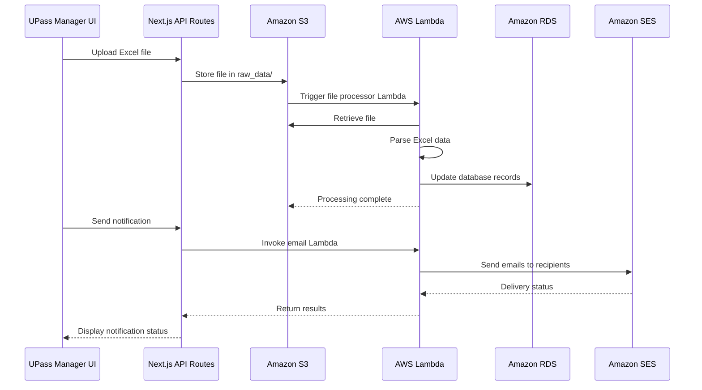

# AWS Integration: Comprehensive Documentation

## 1. Overview

The UPass Manager application leverages AWS cloud services to enhance functionality, improve scalability, and ensure reliability. This document provides a comprehensive guide to the AWS integration within the application, from high-level architecture to low-level implementation details.

## 2. System Architecture

### 2.1 High-Level AWS Architecture

The UPass Manager integrates with four key AWS services:

```
┌─────────────────────────────────────────────────────────────────┐
│                      UPass Manager Application                   │
└───────────────────────────────┬─────────────────────────────────┘
                                │
                                ▼
┌─────────────────────────────────────────────────────────────────┐
│                         AWS Services Layer                       │
├────────────────┬────────────────┬───────────────┬───────────────┤
│                │                │               │               │
│   AWS Lambda   │  Amazon RDS    │   Amazon S3   │  Amazon SES   │
│                │                │               │               │
└────────┬───────┴────────┬───────┴───────┬───────┴───────┬───────┘
         │                │                │               │
         │                │                │               │
         ▼                ▼                ▼               ▼
┌────────────────┐ ┌─────────────┐ ┌─────────────┐ ┌─────────────┐
│  Serverless    │ │   Database  │ │   Storage   │ │    Email    │
│  Computing     │ │   Services  │ │   Services  │ │   Services  │
└────────────────┘ └─────────────┘ └─────────────┘ └─────────────┘
```

### 2.2 Functional Flow

1. **Data Import Flow**:
   - Admin uploads Excel file via UI
   - File saved to Amazon S3 bucket
   - S3 event triggers Lambda function
   - Lambda processes data and updates RDS database

2. **Notification Flow**:
   - User initiates notification action
   - API route invokes Lambda function
   - Lambda sends emails using Amazon SES
   - Results returned to application

### 2.3 Technical Diagram



## 3. AWS Services Configuration

### 3.1 AWS Lambda

#### 3.1.1 File Processor Lambda

**Purpose**: Processes Excel files containing UPass records and updates the database.

**Implementation Details**:
- **File Path**: `src/cloud/lambda-code/lambda_handler.mjs`
- **Runtime**: Node.js 14.x
- **Memory**: 256 MB
- **Timeout**: 60 seconds
- **Handler**: `lambda_handler.handler`
- **Event Source**: S3 bucket (object creation events)

**Environment Variables**:
```
RDS_HOST=your-database-endpoint.rds.amazonaws.com
RDS_USER=your_database_user
RDS_PASSWORD=your_database_password
RDS_DB=your_database_name
```

**Code Analysis**:
The Lambda function performs several key operations:
1. Extracts the S3 event information (bucket name and object key)
2. Validates that the file is in the "raw_data/" folder
3. Determines which database table to update based on filename patterns:
   - "Mockup_Data_UPass_Fall_2024" → "u_pass_manager_fall_2024"
   - "Mockup_Data_UPass_Spring_2024" → "u_pass_manager_spring_2024"
   - Other "Mockup_Data_UPass" files → "u_pass_manager_current"
4. Retrieves and parses the Excel file using the XLSX library
5. Connects to the RDS database using the mysql2 library
6. For each row in the Excel file:
   - Extracts field values
   - Formats date fields appropriately
   - Converts "Yes"/"No" strings to boolean values
   - Inserts or updates records using an UPSERT operation (INSERT ... ON DUPLICATE KEY UPDATE)

**Lambda Entry Point**:
```javascript
export const handler = async (event) => {
  try {
    // Validate S3 event
    if (!event.Records || event.Records.length === 0) {
      console.log('No S3 records found in event.');
      return { statusCode: 400, body: 'No S3 records found.' };
    }
    
    const bucket = event.Records[0].s3.bucket.name;
    const key = decodeURIComponent(event.Records[0].s3.object.key.replace(/\+/g, ' '));
    // ... processing logic ...
    
    return { statusCode: 200, body: `Database table ${tableName} updated successfully` };
  } catch (error) {
    console.error('Error processing file:', error);
    return { statusCode: 500, body: JSON.stringify(error) };
  }
};
```

#### 3.1.2 Email Notification Lambda

**Purpose**: Sends email notifications to students using Amazon SES.

**Implementation Details**:
- **File Path**: `src/cloud/lambda-code 2/index.js`
- **Runtime**: Node.js 14.x
- **Memory**: 128 MB
- **Timeout**: 30 seconds
- **Handler**: `index.handler`
- **Trigger**: Direct invocation from application API routes

**Environment Variables**:
```
SOURCE_EMAIL=gettingaround@vt.edu
```

**Code Analysis**:
The Email Notification Lambda function:
1. Validates the input payload (recipients, subject, message)
2. Initializes the SES client
3. Iterates through each recipient:
   - Creates email parameters (source, destination, message)
   - Sends the email using SES
   - Tracks successful and failed deliveries
   - Implements rate limiting (500ms delay between emails)
4. Returns a response with a summary of email delivery results

**Lambda Invocation from API Route**:
```javascript
// API route that invokes the Lambda function
export default async function handler(req, res) {
  if (req.method !== 'POST') {
    return res.status(405).json({ message: 'Method not allowed' });
  }

  const { recipients, subject, message } = req.body;
  
  // Input validation...
  
  try {
    // Initialize Lambda client
    const lambda = new LambdaClient({ 
      region: process.env.AWS_REGION || "us-east-2",
      credentials: {
        accessKeyId: process.env.AWS_ACCESS_KEY_ID,
        secretAccessKey: process.env.AWS_SECRET_ACCESS_KEY
      }
    });
    
    // Prepare payload and invoke Lambda
    const payload = { recipients, subject, message };
    const command = new InvokeCommand({
      FunctionName: process.env.LAMBDA_FUNCTION_NAME || 'CS5934_G6_SES',
      Payload: JSON.stringify(payload),
      InvocationType: 'RequestResponse'
    });
    
    const response = await lambda.send(command);
    
    // Process response...
    
    return res.status(200).json({
      message: 'Notifications sent successfully via Lambda',
      // Additional result data...
    });
  } catch (error) {
    return res.status(500).json({ 
      message: 'Failed to send notifications via Lambda', 
      error: error.message 
    });
  }
}
```

### 3.2 Amazon RDS (Relational Database Service)

#### 3.2.1 Database Configuration

**Instance Type**: MySQL-compatible database service

**Purpose**: Central data store for all UPass records and application data

**Database Tables**:
1. `u_pass_manager_current` - Current semester UPass data
2. `u_pass_manager_fall_2024` - Fall 2024 semester UPass data
3. `u_pass_manager_spring_2024` - Spring 2024 semester UPass data

#### 3.2.2 Database Schema

Table schema (consistent across all UPass tables):

```sql
CREATE TABLE u_pass_manager_current (
  U_Pass_ID VARCHAR(50) PRIMARY KEY,
  Active_U_Pass_Card VARCHAR(50),
  Replaced_U_Pass_Card VARCHAR(50),
  Metro_Acct VARCHAR(50),
  Distribution_Date DATETIME,
  Picked_Up_By VARCHAR(100),
  Student_ID VARCHAR(50),
  First_Name VARCHAR(100),
  Last_Name VARCHAR(100),
  Email VARCHAR(100),
  Disclaimer_Signed BOOLEAN DEFAULT FALSE,
  Notes TEXT
);
```

#### 3.2.3 Connection Code

**Database Connection in Lambda**:
```javascript
// Connect to RDS using environment variables
const connection = await mysql.createConnection({
  host: process.env.RDS_HOST,
  user: process.env.RDS_USER,
  password: process.env.RDS_PASSWORD,
  database: process.env.RDS_DB,
});
```

**Database Connection in Application**:
```javascript
// backend-api/db.js
import mysql from 'mysql2/promise';
import dotenv from 'dotenv';

dotenv.config();

// Create connection pool
const pool = mysql.createPool({
  host: process.env.DB_HOST,
  user: process.env.DB_USER,
  password: process.env.DB_PASSWORD,
  database: process.env.DB_DATABASE,
  waitForConnections: true,
  connectionLimit: 10,
  queueLimit: 0
});

// Helper function to execute queries
export async function executeQuery(query, params) {
  try {
    const [rows] = await pool.execute(query, params);
    return rows;
  } catch (error) {
    console.error('Database error:', error);
    throw error;
  }
}

export default pool;
```

### 3.3 Amazon S3 (Simple Storage Service)

#### 3.3.1 S3 Configuration

**Bucket Purpose**: Stores uploaded Excel files containing UPass data.

**Bucket Structure**:
- `raw_data/` folder: Upload destination that triggers Lambda processing
- Naming conventions determine database table targets

#### 3.3.2 S3 Event Configuration

**Event Type**: `s3:ObjectCreated:*`
**Prefix**: `raw_data/`
**Suffix**: `.xlsx`
**Destination**: Lambda function (File Processor)

#### 3.3.3 File Upload Implementation

The application uploads files to S3 through the `/api/upload` endpoint:

```javascript
// pages/api/upload.js (simplified)
import { S3Client, PutObjectCommand } from "@aws-sdk/client-s3";
import { v4 as uuidv4 } from 'uuid';

export default async function handler(req, res) {
  if (req.method !== 'POST') {
    return res.status(405).json({ message: 'Method not allowed' });
  }

  try {
    const s3Client = new S3Client({
      region: process.env.AWS_REGION,
      credentials: {
        accessKeyId: process.env.AWS_ACCESS_KEY_ID,
        secretAccessKey: process.env.AWS_SECRET_ACCESS_KEY,
      },
    });

    // Generate a unique key for the file
    const fileKey = `raw_data/Mockup_Data_UPass_${uuidv4()}.xlsx`;
    
    // Upload to S3
    const command = new PutObjectCommand({
      Bucket: process.env.S3_BUCKET_NAME,
      Key: fileKey,
      Body: req.body,
      ContentType: 'application/vnd.openxmlformats-officedocument.spreadsheetml.sheet',
    });

    await s3Client.send(command);
    
    return res.status(200).json({ 
      message: 'File uploaded successfully',
      key: fileKey 
    });
  } catch (error) {
    console.error('Error uploading file:', error);
    return res.status(500).json({ 
      message: 'Error uploading file', 
      error: error.message 
    });
  }
}
```

### 3.4 Amazon SES (Simple Email Service)

#### 3.4.1 SES Configuration

**Purpose**: Sends email notifications to students about their UPass status.

**Sender Email**: `gettingaround@vt.edu` (verified in SES)

**SES Region**: Configurable via environment variables (default: us-east-2)

#### 3.4.2 Implementation

The Email Notification Lambda uses SES SDK to send emails:

```javascript
// Simplified example from the Lambda function
import { SESClient, SendEmailCommand } from "@aws-sdk/client-ses";

const ses = new SESClient({ region: "us-east-2" });

// For each recipient
const params = {
  Source: process.env.SOURCE_EMAIL,
  Destination: { ToAddresses: [recipient] },
  Message: {
    Subject: { Data: subject },
    Body: {
      Html: { Data: message },
      Text: { Data: textVersion }
    }
  }
};

// Send the email
try {
  const command = new SendEmailCommand(params);
  const result = await ses.send(command);
  console.log(`Email sent to ${recipient}, MessageId: ${result.MessageId}`);
  successful.push(recipient);
} catch (error) {
  console.error(`Failed to send email to ${recipient}:`, error);
  failed.push({ email: recipient, reason: error.message });
}
```

## 4. Integration Points with UPass Manager

### 4.1 API Routes

The application interacts with AWS services through Next.js API routes:

1. **`/api/send-notification`** - Invokes the Email Notification Lambda
2. **`/api/upload`** - Uploads files to S3
3. **`/api/notify-new-distributor`** - Uses Lambda to send notifications to new distributors

### 4.2 AWS SDK Usage

The application uses the AWS SDK for JavaScript (v3) to interact with AWS services:

```javascript
// AWS SDK imports
import { LambdaClient, InvokeCommand } from "@aws-sdk/client-lambda";
import { S3Client, PutObjectCommand, GetObjectCommand } from "@aws-sdk/client-s3";
```

### 4.3 Frontend Integration

The frontend components interact with AWS services indirectly through API routes:

**Upload Component**:
```javascript
// Simplified example
const handleUpload = async (file) => {
  const formData = new FormData();
  formData.append('file', file);
  
  try {
    const response = await fetch('/api/upload', {
      method: 'POST',
      body: formData
    });
    
    const data = await response.json();
    if (response.ok) {
      setMessage('File uploaded successfully. Processing has begun.');
    } else {
      setError(data.message || 'Error uploading file');
    }
  } catch (error) {
    setError('Error: ' + error.message);
  }
};
```

**Notification Component**:
```javascript
// Simplified example
const sendNotifications = async () => {
  try {
    const response = await fetch('/api/send-notification', {
      method: 'POST',
      headers: {
        'Content-Type': 'application/json',
      },
      body: JSON.stringify({
        recipients: selectedEmails,
        subject: emailSubject,
        message: emailMessage
      }),
    });
    
    const result = await response.json();
    if (response.ok) {
      setStatus(`Successfully sent ${result.sent} of ${result.total} notifications.`);
    } else {
      setError(result.message || 'Failed to send notifications');
    }
  } catch (error) {
    setError('Error: ' + error.message);
  }
};
```

## 5. Environment Configuration

### 5.1 Required Environment Variables

**AWS Credentials**:
```
AWS_ACCESS_KEY_ID=your_access_key
AWS_SECRET_ACCESS_KEY=your_secret_key
AWS_REGION=us-east-2
```

**Lambda Configuration**:
```
LAMBDA_FUNCTION_NAME=CS5934_G6_SES
```

**S3 Configuration**:
```
S3_BUCKET_NAME=your-s3-bucket-name
```

**RDS Configuration**:
```
DB_HOST=your_database_host
DB_USER=your_database_user
DB_PASSWORD=your_database_password
DB_DATABASE=your_database_name
```

### 5.2 Local Development vs. Production

For local development, store these variables in a `.env` file at the project root.
For production deployment, configure these variables in your hosting environment.

## 6. Security Considerations

### 6.1 IAM Roles and Permissions

The application uses IAM roles with least privilege principles:

1. **Lambda Execution Role** - Grants Lambda functions permissions to:
   - Read from specific S3 bucket
   - Access RDS database
   - Send emails via SES

2. **Application IAM User** - Has permissions to:
   - Invoke Lambda functions
   - Write to specific S3 bucket
   - Read from RDS (optional if using Lambda as proxy)

### 6.2 Environment Variables

Sensitive information (credentials, connection strings) is stored in environment variables, not hardcoded.

### 6.3 SES Security

1. **Email Verification** - Sender email addresses must be verified in SES
2. **SES Sandbox Mode** - During development, recipient emails must also be verified
3. **Production Mode** - Requires SES production access request for unrestricted sending

## 7. Error Handling and Monitoring

### 7.1 AWS CloudWatch Integration

All Lambda functions log to CloudWatch for monitoring and troubleshooting:

```javascript
console.log('Processing file:', filename);  // Logged to CloudWatch
console.error('Error sending email:', error);  // Error logged to CloudWatch
```

### 7.2 Application Error Handling

The application implements comprehensive error handling for AWS service interactions:

```javascript
try {
  // AWS service interaction
} catch (error) {
  console.error('Error details:', error);
  
  // Determine appropriate response based on error type
  if (error.name === 'CredentialsError') {
    return res.status(500).json({ message: 'AWS credential configuration error' });
  } else if (error.name === 'ServiceUnavailableException') {
    return res.status(503).json({ message: 'AWS service temporarily unavailable' });
  } else {
    return res.status(500).json({ 
      message: 'Unexpected error interacting with AWS services',
      error: process.env.NODE_ENV === 'production' ? 'Internal server error' : error.message
    });
  }
}
```

## 8. Deployment Instructions

### 8.1 Lambda Deployment

1. **Prepare Lambda Code**:
   ```bash
   cd src/cloud/lambda-code
   npm install
   zip -r lambda-function.zip .
   ```

2. **Deploy via AWS Console**:
   - Create or update Lambda function
   - Upload ZIP file
   - Configure environment variables
   - Set up S3 event trigger

3. **Configure IAM Role**:
   - Attach AWSLambdaBasicExecutionRole
   - Add custom policy for S3, RDS, and SES access

### 8.2 Testing AWS Integration

1. **Test File Processing**:
   - Upload Excel file to S3 bucket in `raw_data/` folder
   - Check CloudWatch logs for processing status
   - Verify database updates in RDS

2. **Test Email Notifications**:
   - Use application UI to send test notification
   - Check CloudWatch logs for email sending status
   - Verify email receipt at destination

## 9. Troubleshooting Guide

### 9.1 Common Issues

#### File Processor Lambda Issues

1. **File Not Processed**:
   - Verify file is in `raw_data/` folder
   - Check file format is valid Excel (.xlsx)
   - Examine CloudWatch logs for errors

2. **Database Connection Failures**:
   - Verify environment variables are correctly set
   - Check network configuration (VPC, security groups)
   - Test database connectivity from Lambda

#### Email Notification Issues

1. **Emails Not Sending**:
   - Verify SES sender email is verified
   - Check recipient emails are valid
   - In sandbox mode, verify recipients are verified
   - Check SES sending limits

2. **Lambda Function Not Responding**:
   - Verify Lambda function name in environment variables
   - Check AWS credentials have invoke permissions
   - Check Lambda execution timeout settings

### 9.2 Debugging Strategy

1. **Examine CloudWatch Logs**:
   - Navigate to AWS CloudWatch console
   - Find log group for relevant Lambda function
   - Review recent log streams for error messages

2. **Test AWS Services Directly**:
   - Use AWS CLI to test S3, Lambda, and SES directly
   - Verify service functionality outside of application

3. **Check IAM Permissions**:
   - Review IAM roles and policies
   - Verify necessary permissions are granted
   - Check for overly restrictive policies

## 10. Future Enhancements

### 10.1 Planned AWS Integration Improvements

1. **CloudFront for Content Delivery**:
   - Implement AWS CloudFront to deliver static assets
   - Improve global performance and reduce latency

2. **CloudWatch Dashboards**:
   - Create custom dashboards to monitor application metrics
   - Set up alarms for critical service failures

3. **AWS Cognito Integration**:
   - Replace custom auth with AWS Cognito
   - Implement MFA and enhanced security features

4. **Lambda Layers**:
   - Refactor Lambda dependencies into shared layers
   - Reduce deployment package size and improve maintainability

### 10.2 Scaling Considerations

As the UPass Manager application grows:

1. **RDS Scaling**:
   - Monitor database performance metrics
   - Scale up instance class or implement read replicas as needed

2. **Lambda Concurrency**:
   - Monitor Lambda concurrent execution metrics
   - Adjust reserved concurrency based on usage patterns

3. **S3 Data Lifecycle**:
   - Implement S3 lifecycle policies for older data
   - Archive or delete processed files automatically

## 11. Appendix

### 11.1 AWS Service Reference Documentation

- [AWS Lambda Developer Guide](https://docs.aws.amazon.com/lambda/latest/dg/welcome.html)
- [Amazon RDS User Guide](https://docs.aws.amazon.com/AmazonRDS/latest/UserGuide/Welcome.html)
- [Amazon S3 Developer Guide](https://docs.aws.amazon.com/AmazonS3/latest/dev/Welcome.html)
- [Amazon SES Developer Guide](https://docs.aws.amazon.com/ses/latest/dg/Welcome.html)

### 11.2 AWS SDK Documentation

- [AWS SDK for JavaScript v3](https://docs.aws.amazon.com/AWSJavaScriptSDK/v3/latest/)
- [Lambda Client](https://docs.aws.amazon.com/AWSJavaScriptSDK/v3/latest/clients/client-lambda/index.html)
- [S3 Client](https://docs.aws.amazon.com/AWSJavaScriptSDK/v3/latest/clients/client-s3/index.html)
- [SES Client](https://docs.aws.amazon.com/AWSJavaScriptSDK/v3/latest/clients/client-ses/index.html)